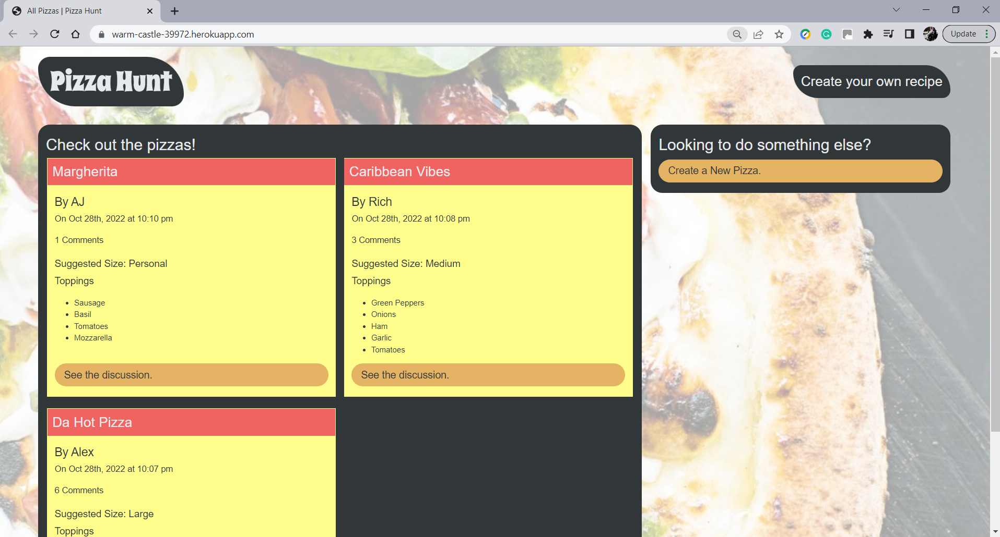
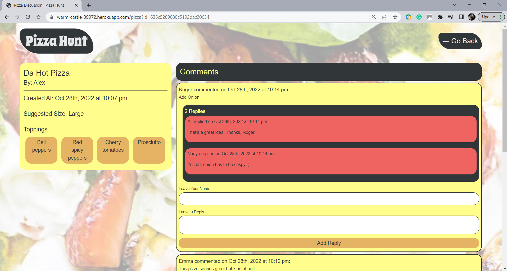

# Pizza Hunt

## Table of Contents

- [Project Description](#Project-Description)
- [User Story](#User-Story)
- [Screenshots](#Screenshots)
- [Technologies](#Technologies)
- [Questions](#Questions)
- [Links](#Links)


## Project Description
Pizza Hunt is a social media application that lets users connect with each other based on their love of pizza. In Pizza Hunt, users can share and discuss their dream pizza-topping combinations.

This project develops the backend part of the application "Pizza Hunt", a web page where users can create pizza recipes, post comments on other users' pizzas and add replies to comments.

The project created the Express.js API routes and connects the back end to the NoSQL-database MongoDB to handle pizzas data and comments. Finally, this porject integrates the API code with the client’s existing frontend codebase.
###### [Back to Index](#Table-of-Contents)

## User Story

```
As a user:
I can create and customize my own unique pizza.
I can retrieve data about my pizzas or other pizzas created through the app.
I want to be able to leave a comment on a pizza that has been created and reply to other users' comments.
```
###### [Back to Index](#Table-of-Contents)

## Screenshots


###### [Back to Index](#Table-of-Contents)

## Technologies


###### [Back to Index](#Table-of-Contents)


## Questions
Please, feel free to get in touch with me at any member of the development team to discuss any inquiries or suggestions for the project. We will be happy to connect with you!
###### [Back to Index](#Table-of-Contents)

## Links
- [Application Repository](https://github.com/AlexJCturbo/pizza-hunt)
- [Deployed Link](https://warm-castle-39972.herokuapp.com/)
###### [Back to Index](#Table-of-Contents)
